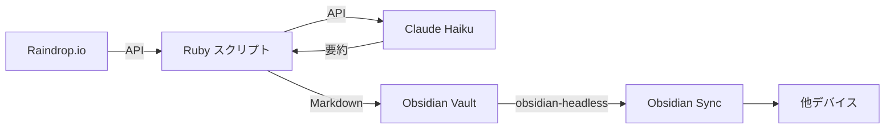

日々のブックマークを自動で要約・整理し、Obsidian のナレッジベースに蓄積するシステムを Ruby スクリプトと **obsidian-headless** で構築しました。この記事では、**Raindrop.io API** でブックマーク取得、**Claude Haiku 4.5** で要約生成、デイリーノートへの書き込み、**systemd** による同期の永続化までの実装手順を解説します。

:::message
この記事の執筆にあたり、AIによる支援（レビュー、文章の整形、ファクトチェック）を受けています。内容の正確性については可能な限り筆者が確認していますが、もしも誤りを見つけた場合はコメントでお知らせ頂けると嬉しいです。
:::

## 背景

ブックマークが「保存しただけ」で埋もれてしまう問題を解決するために、自動要約・整理の仕組みを構築した動機と、目指すシステムの全体像を説明します。

### ブックマークは溜まるが見返さない問題

技術記事やドキュメントを見つけたらとりあえずブックマークする、という習慣を持つ方は多いのではないでしょうか。しかし、ブックマークは溜まる一方で、後から見返すことはほとんどありません。タイトルと URL だけでは何が書いてあったか思い出せず、Raindrop.io 上でキーワード検索しても記事の内容までは引っかからないという状況が生まれます。

ブックマークを「保存した」だけでは知識として定着しません。内容の要約と整理を行い、日常的に目を通すナレッジベースに統合してこそ価値が生まれます。

### 目指す仕組み

この課題に対して、以下の自動化パイプラインを構築しました。



毎日 **cron** でスクリプトを実行し、前日のブックマークを取得して LLM で要約を生成し、**Obsidian** のデイリーノート（コアプラグインが提供する、日付ごとに自動作成されるノート）に追記します。obsidian-headless が常駐してファイル変更を検知し、他デバイスへ自動で同期します。

## システム全体の構成

### 処理の流れ

システムは大きく4つのステップで動作します。

1. **ブックマーク取得**: Raindrop.io API で前日に作成されたブックマークを一括取得する
2. **要約生成**: 各ブックマークのメタデータ（タイトル、抜粋、ハイライトなど）を Claude Haiku に渡して日本語の要約を生成する
3. **デイリーノート書き込み**: Obsidian Vault のデイリーノートに Markdown セクションとして追記する
4. **同期**: obsidian-headless がファイル変更を検知し、**Obsidian Sync** 経由で他デバイスに同期する

GUI なし環境（サーバーなど）でも Obsidian Sync を利用するために、ヘッドレスクライアント（obsidian-headless）を使用しています。デスクトップ環境であれば Obsidian アプリの Sync 機能で代替可能です。

### 使用する技術とサービス

| 技術・サービス | 役割 |
|---|---|
| **Raindrop.io** API | ブックマークの取得元 |
| **Claude Haiku 4.5** (claude-haiku-4-5-20251001) | 要約の自動生成 |
| **Obsidian** | ナレッジベース（デイリーノート） |
| **obsidian-headless** (`ob` CLI) | GUI なし環境での Obsidian Sync |
| **Ruby**（標準ライブラリのみ） | メインスクリプト |
| cron + systemd | 定期実行と同期の永続化 |

スクリプトは Ruby の標準ライブラリ（`net/http`, `json`, `date`, `fileutils`）のみで実装しており、gem の追加インストールは不要です。

## Raindrop.io API でブックマークを取得する

Raindrop.io API を使って、指定日に作成されたブックマークとそのハイライトを取得する処理を実装します。

### API トークンの取得

Raindrop.io API は OAuth 2.0 を採用しています。個人利用であれば、開発者設定画面からテストトークンを発行するのが簡単です。テストトークンには有効期限が明示されておらず（通常トークンは2週間で失効）、長期間の運用にも利用できます。cron 運用でトークンリフレッシュの仕組みを実装する必要がありません。

取得したトークンは環境変数 `RAINDROP_TOKEN` に設定します。

### 日付指定でブックマークを検索する

`GET /rest/v1/raindrops/0` エンドポイントの `search` パラメータを使って、特定日のブックマークを取得します。`search` パラメータはアプリ内の検索バーと同じテキスト演算子を受け付けます。

```ruby:raindrop_to_obsidian.rb
def fetch_bookmarks(date)
  search = "created:#{date.strftime('%Y-%m-%d')}"

  items = []
  page  = 0

  loop do
    data = raindrop_get('/raindrops/0', search: search, perpage: 50, page: page)
    batch = data['items'] || []
    items.concat(batch)
    break if batch.size < 50
    page += 1
  end

  items
end
```

`created:YYYY-MM-DD` 演算子で作成日を指定しています。1ページの最大取得件数は50件のため、それ以上ある場合はページネーションで全件を取得します。

:::message alert
`search` パラメータは テキスト形式の演算子のみ受け付けます。MongoDB 風の構造化クエリ（`$gte`, `$lt` など）を渡しても空の結果が返るだけでエラーにならないため、気づきにくい落とし穴です。
:::

API 呼び出しの共通部分は以下のようにシンプルなヘルパーメソッドにまとめています。

```ruby:raindrop_to_obsidian.rb
def raindrop_get(path, params = {})
  uri = URI("https://api.raindrop.io/rest/v1#{path}")
  uri.query = URI.encode_www_form(params) unless params.empty?
  req = Net::HTTP::Get.new(uri)
  req['Authorization'] = "Bearer #{RAINDROP_TOKEN}"
  res = Net::HTTP.start(uri.hostname, uri.port, use_ssl: true) { |h| h.request(req) }
  JSON.parse(res.body)
end
```

### ハイライト・ノートの取得

ブックマークにハイライトが付いている場合、それを要約のコンテキストとしても活用したいところです。ハイライトは個別ブックマークの API（`GET /rest/v1/raindrop/{id}`）のレスポンスに含まれます。

```ruby:raindrop_to_obsidian.rb
def fetch_highlights(raindrop_id)
  data = raindrop_get("/raindrop/#{raindrop_id}")
  data.dig('item', 'highlights') || []
end
```

この実装ではブックマークごとに API リクエストが1回発生します。日次で数件〜十数件の規模であれば個別取得で十分です（レートリミットは1分あたり120リクエスト）。

## Claude Haiku 4.5 で要約を自動生成する

各ブックマークのメタデータを Anthropic API に渡し、日本語の要約を自動生成する処理を実装します。プロンプト設計の工夫についても説明します。

### Anthropic API の呼び出し

各ブックマークのメタデータを Anthropic API に渡して、日本語の要約を生成します。モデルは **Claude Haiku 4.5** を使用しています。日次で数件〜十数件のブックマークを処理する用途であれば、Haiku の品質で十分であり、コストも1日10件の処理で月額1ドル未満と実用上無視できる水準です。

```ruby:raindrop_to_obsidian.rb
def summarize_bookmark(item, highlights)
  title      = item['title'].to_s
  url        = item['link'].to_s
  excerpt    = item['excerpt'].to_s
  tags       = (item['tags'] || []).join(', ')
  collection = item.dig('collection', 'title').to_s
  hl_texts   = highlights.map { |h| h['text'] }.compact.join("\n")
  note       = item['note'].to_s

  context = <<~TEXT
    タイトル: #{title}
    URL: #{url}
    コレクション: #{collection}
    タグ: #{tags}
    抜粋: #{excerpt}
    ノート: #{note.empty? ? '（なし）' : note}
    ハイライト:
    #{hl_texts.empty? ? '（なし）' : hl_texts}
  TEXT

  prompt = <<~PROMPT
    以下のウェブページの情報をもとに、日本語で2〜3文の簡潔な要約を作成してください。
    要約は「何についてのページか」「なぜ重要か・何が学べるか」を含めてください。
    余計な前置きや説明は不要です。要約文のみ出力してください。

    #{context}
  PROMPT

  uri = URI('https://api.anthropic.com/v1/messages')
  req = Net::HTTP::Post.new(uri)
  req['Content-Type']      = 'application/json'
  req['x-api-key']         = ANTHROPIC_API_KEY
  req['anthropic-version'] = '2023-06-01'
  req.body = JSON.generate(
    model:      'claude-haiku-4-5-20251001',
    max_tokens: 300,
    messages:   [{ role: 'user', content: prompt }]
  )

  res  = Net::HTTP.start(uri.hostname, uri.port, use_ssl: true) { |h| h.request(req) }
  data = JSON.parse(res.body)
  data.dig('content', 0, 'text')&.strip || '（要約取得失敗）'
end
```

API の呼び出しに失敗した場合は「（要約取得失敗）」という文字列を返し、ブックマーク自体の記録は継続します。要約の取得に失敗しても全体の処理が止まらない設計です。

### プロンプト設計: 何を要約させるか

プロンプトでは「何についてのページか」「なぜ重要か・何が学べるか」の2点を要約に含めるよう指示しています。ページの本文を取得しているわけではなく、タイトル・抜粋・ハイライト・ノートといったメタデータだけから要約を生成する点がポイントです。

メタデータが豊富なほど要約の品質は高くなります。特にハイライトやノートが付いていると、LLM は記事の重要な部分を把握したうえで要約を生成できます。逆にタイトルと URL だけでは一般的な説明に留まりがちです。ブックマーク時にメタデータを充実させておくことが、要約の精度を上げる鍵になります。

## Obsidian デイリーノートに書き込む

生成した要約を Obsidian のデイリーノートに Markdown 形式で書き込む処理を実装します。テンプレート対応や重複防止の仕組みも含めて解説します。

### デイリーノートのパス構造とテンプレート対応

デイリーノートは `Daily/YYYY/YYYY-MM-DD.md` のパスを組み立てて管理しています。ノートが存在しない場合は、Vault 内のテンプレート（`Templates/Daily.md`）からプレースホルダーを置換して新規作成します。

```ruby:raindrop_to_obsidian.rb
def build_note_from_template(date)
  date_str = date.strftime('%Y-%m-%d')

  unless File.exist?(TEMPLATE_PATH)
    warn "テンプレートが見つかりません: #{TEMPLATE_PATH}"
    return "# #{date_str}\n"
  end

  content = File.read(TEMPLATE_PATH)

  content
    .gsub('{{date}}', date_str)
    .gsub('{{title}}', date_str)
    .gsub(/\{\{date:[-YMD]+\}\}/, date_str)
    .gsub(/<%\s*tp\.date\.now\([^)]*\)\s*%>/, date_str)
end
```

`{{date}}` や `{{date:YYYY-MM-DD}}`、**Templater** プラグインの `<% tp.date.now() %>` 形式にも対応しています。テンプレートが見つからない場合はシンプルな見出しのみで作成するフォールバックも備えています。

### Markdown セクションの生成

ブックマークの一覧は、以下のような Markdown セクションとして生成されます。

```ruby:raindrop_to_obsidian.rb
def build_section(bookmarks)
  lines = []
  lines << "## 📚 Raindrop (#{TARGET_DATE.strftime('%Y-%m-%d')})"
  lines << ''

  bookmarks.each do |item|
    title      = item['title'] || item['link']
    url        = item['link']
    collection = item.dig('collection', 'title') || '未分類'
    tags       = (item['tags'] || []).map { |t| "##{t}" }.join(' ')

    highlights = fetch_highlights(item['_id'])
    summary    = summarize_bookmark(item, highlights)

    lines << "### [#{title}](#{url})"
    lines << "_#{collection}_ #{tags}".strip
    lines << ''
    lines << summary
    lines << ''

    note = item['note'].to_s
    unless note.empty?
      lines << '**ノート:**'
      lines << note
      lines << ''
    end

    if highlights.any?
      lines << '**ハイライト:**'
      highlights.each { |h| lines << "> #{h['text']}" }
      lines << ''
    end

    lines << '---'
    lines << ''
  end

  lines.join("\n")
end
```

各ブックマークには、リンク付きタイトル、コレクション名（Raindrop.io におけるフォルダ的な分類単位）、タグ、LLM による要約、ノート、ハイライトが含まれます。Obsidian のタグ記法（`#タグ名`）をそのまま使用しているため、Vault 全体でのタグ検索にも対応します。

### 重複書き込みの防止

cron の再実行やリカバリ実行で同じ日のブックマークが重複して書き込まれないよう、セクション見出しの存在チェックを行っています。

```ruby:raindrop_to_obsidian.rb
def write_daily_note(content)
  note_path = daily_note_path(TARGET_DATE)
  FileUtils.mkdir_p(File.dirname(note_path))

  if File.exist?(note_path)
    existing = File.read(note_path)
    if existing.include?("## 📚 Raindrop (#{TARGET_DATE.strftime('%Y-%m-%d')})")
      puts "すでに書き込み済みです: #{note_path}"
      return
    end
    File.open(note_path, 'a') { |f| f.puts "\n#{content}" }
  else
    note_body = build_note_from_template(TARGET_DATE)
    File.write(note_path, note_body + "\n" + content)
  end
end
```

既存ノートに同日のセクションが含まれていれば追記をスキップします。ノートが存在しなければテンプレートから新規作成し、存在すれば末尾に追記します。

## cron で毎日自動実行する

スクリプトを cron で定期実行するための環境構築と設定方法を説明します。

### 環境変数とラッパースクリプト

cron から Ruby スクリプトを実行する場合、環境変数の設定とランタイムの初期化が必要です。ラッパースクリプトを用意して対応します。

```bash:raindrop_to_obsidian_cron.sh
#!/bin/bash
# cron から実行するためのラッパー

export RAINDROP_TOKEN="your_raindrop_token"
export ANTHROPIC_API_KEY="your_anthropic_api_key"
export OBSIDIAN_VAULT="/path/to/your/vault"

# rbenv を初期化
export PATH="$HOME/.rbenv/bin:$PATH"
eval "$(rbenv init - bash)"

exec ruby "$HOME/path/to/raindrop_to_obsidian.rb" "$@"
```

cron のジョブはログインシェルとは異なる環境で実行されるため、**rbenv** の初期化を明示的に行っています。`exec` で Ruby プロセスに置き換えることで、不要なシェルプロセスを残しません。

:::message
API トークンはラッパースクリプトにハードコードするのではなく、シークレット管理ツールや暗号化ファイルから読み込む方法も検討してください。`direnv` を使って `.envrc` から環境変数を読み込む方法も手軽です。

```bash
# .envrc の例
export RAINDROP_TOKEN="your_raindrop_token"
export ANTHROPIC_API_KEY="your_anthropic_api_key"
export OBSIDIAN_VAULT="/path/to/your/vault"
```
:::

### crontab の設定

毎朝、前日のブックマークを処理するよう crontab に登録します。

```text
0 8 * * * /path/to/raindrop_to_obsidian_cron.sh >> /tmp/raindrop_to_obsidian.log 2>&1
```

スクリプトはデフォルトで「前日」のブックマークを処理します。引数に日付（`YYYY-MM-DD`）を渡せば特定日のブックマークを処理できるため、cron の実行に失敗した日の分を後から処理するといったリカバリにも対応できます。

## obsidian-headless で同期を永続化する

obsidian-headless を systemd ユーザーサービスとして常駐させ、Vault の変更を自動的に Obsidian Sync で同期する設定を行います。

### インストールとセットアップ

**obsidian-headless** は Obsidian Sync のヘッドレスクライアントです。デスクトップアプリなしでコマンドラインから Vault を同期できます。利用には Obsidian Sync のサブスクリプションが必要です。

```bash
npm install -g obsidian-headless
```

:::message alert
Node.js 22 以上が必須です。obsidian-headless は WebSocket をグローバルオブジェクトとして使用しており、これは Node.js 22 以降でネイティブ対応されています。古いバージョンでは `ReferenceError: WebSocket is not defined` で起動に失敗します。
:::

インストール後、ログインと Vault のセットアップを行います。

```bash
ob login --email your@email.com --password your_password
ob sync-setup --vault "YourVault" --path /path/to/your/vault
```

セットアップが完了したら、`ob sync --continuous` で継続的同期モードを起動できます。このモードではファイルシステムの変更を監視し、変更を検知するたびに自動で同期を実行します。

### systemd ユーザーサービスの設定

`ob sync --continuous` を常駐させるため、systemd ユーザーサービスとして設定します。

```ini:~/.config/systemd/user/obsidian-sync.service
[Unit]
Description=Obsidian Headless Sync
After=network-online.target

[Service]
Type=simple
# 自身の環境に合わせて nvm のパスを変更してください
Environment="PATH=/home/your-user/.nvm/versions/node/v24.x.x/bin:/usr/bin:/bin"
# 自身の環境に合わせて Vault のパスを変更してください
WorkingDirectory=%h/Documents/your-vault
# 自身の環境に合わせて ob のパスを変更してください
ExecStart=/home/your-user/.nvm/versions/node/v24.x.x/bin/ob sync --continuous
Restart=on-failure
RestartSec=10

[Install]
WantedBy=default.target
```

:::message
systemd の `%h` スペシファイアはホームディレクトリに展開されます。`WorkingDirectory` だけでなく `Environment` や `ExecStart` でも使用できるため、上記の例ではフルパスを直接書いていますが、`%h` に置き換えることも可能です。
:::

この設定には3つの重要なポイントがあります。

- **WorkingDirectory が Vault のパスになる**: `ob sync` は `--path` を省略するとカレントディレクトリを Vault として扱います。`WorkingDirectory` の設定がそのまま同期対象の指定になります
- **ExecStart にフルパスを指定する**: systemd ユーザーサービスはシェルプロファイルを読み込まないため、**nvm** でインストールした `ob` にはパスが通りません
- **Environment で PATH を明示する**: フルパスで `ob` を指定しても、`ob` の shebang（`#!/usr/bin/env node`）が node を探す際にシステムの古い Node.js が使われてしまいます

サービスを有効化して起動します。

```bash
systemctl --user daemon-reload
systemctl --user enable --now obsidian-sync
```

状態の確認やログの参照は以下のコマンドで行えます。

```bash
# サービスの状態確認
systemctl --user status obsidian-sync

# ログ確認
journalctl --user -u obsidian-sync -n 30 --no-pager
```

### つまずきポイント: Node.js バージョンと PATH の問題

systemd 環境でのセットアップでは、Node.js のバージョン解決が最大のつまずきポイントでした。実際に遭遇した問題と解決策を表にまとめます。

| 問題 | 原因 | 解決策 |
|---|---|---|
| `status=203/EXEC` で起動失敗 | `ob` のパスが解決できない | ExecStart にフルパスを指定 |
| `WebSocket is not defined` | shebang 経由でシステムの Node.js v18 が使われた | `Environment="PATH=..."` で nvm 版 Node.js を優先 |
| WorkingDirectory のエラー | Vault パスの指定が間違っていた | `%h/Documents/your-vault` に修正 |

ExecStart にフルパスを書くだけでは不十分という点が直感に反するかもしれません。`ob` の実体は Node.js スクリプトであり、shebang `#!/usr/bin/env node` で `node` を PATH から探索します。`Environment` で nvm 版の Node.js が含まれるパスを設定しないと、システムにインストールされた古い Node.js（この場合 v18）が使われてしまい、WebSocket 未対応のエラーが発生します。

## まとめ

Raindrop.io のブックマークを Claude Haiku 4.5 で自動要約し、Obsidian のデイリーノートに記録するシステムの構築手順を解説しました。ブックマークの「保存して終わり」を脱却し、ナレッジベースとして活用するための仕組みです。

### 運用してみて

このシステムを運用してみると、ブックマークを保存するだけで翌朝にはデイリーノートに要約付きで記録されるという体験は、毎朝モバイルで前日のブックマークを確認でき、Obsidian の全文検索で過去のブックマークを内容ベースで検索できるという点で非常に実用的です。「あの記事なんだっけ」という場面で役立っています。

要約の品質はブックマークのメタデータの充実度に依存します。プロンプト設計のセクションで述べたとおり、ブックマーク時にハイライトやノートを充実させておくことが要約精度を高める鍵です。

### 今後の改善案

- **ハイライト取得の効率化**: 現在はブックマークごとに個別 API リクエストを行っています。件数が多い場合は `GET /rest/v1/highlights` エンドポイントで一括取得し、リクエスト数を削減できます
- **エラーハンドリングの強化**: API のレートリミット超過（HTTP 429）への対応や、リトライ処理の追加が考えられます
- **HTTP ステータスコードの検証**: 現在の実装では API レスポンスのステータスコードを検証していません。エラーレスポンスの適切なハンドリングを追加すべきです
- **要約モデルの選択**: より高品質な要約が必要な場合は、Claude Sonnet など上位モデルへの切り替えも検討できます。コストとのトレードオフで判断してください

## 参考資料

- [Raindrop.io API Documentation](https://developer.raindrop.io)
- [Raindrop.io 検索演算子](https://help.raindrop.io/using-search#operators)
- [Anthropic API Documentation](https://docs.anthropic.com)
- [Obsidian Headless ヘルプ](https://help.obsidian.md/headless)
- [obsidian-headless npm パッケージ](https://www.npmjs.com/package/obsidian-headless)
